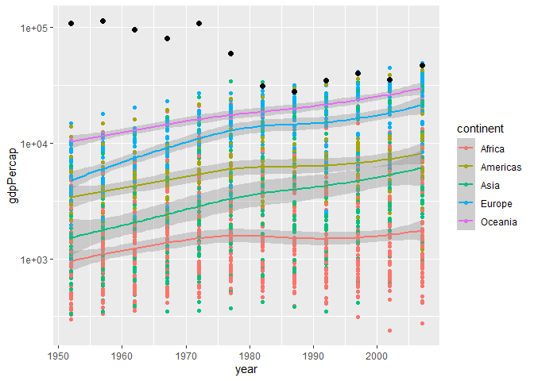

Gapminder
================
Anna Letcher Hartman
2023-2-26

- <a href="#grading-rubric" id="toc-grading-rubric">Grading Rubric</a>
  - <a href="#individual" id="toc-individual">Individual</a>
  - <a href="#due-date" id="toc-due-date">Due Date</a>
- <a href="#guided-eda" id="toc-guided-eda">Guided EDA</a>
  - <a
    href="#q0-perform-your-first-checks-on-the-dataset-what-variables-are-in-this"
    id="toc-q0-perform-your-first-checks-on-the-dataset-what-variables-are-in-this"><strong>q0</strong>
    Perform your “first checks” on the dataset. What variables are in
    this</a>
  - <a
    href="#q1-determine-the-most-and-least-recent-years-in-the-gapminder-dataset"
    id="toc-q1-determine-the-most-and-least-recent-years-in-the-gapminder-dataset"><strong>q1</strong>
    Determine the most and least recent years in the <code>gapminder</code>
    dataset.</a>
  - <a
    href="#q2-filter-on-years-matching-year_min-and-make-a-plot-of-the-gdp-per-capita-against-continent-choose-an-appropriate-geom_-to-visualize-the-data-what-observations-can-you-make"
    id="toc-q2-filter-on-years-matching-year_min-and-make-a-plot-of-the-gdp-per-capita-against-continent-choose-an-appropriate-geom_-to-visualize-the-data-what-observations-can-you-make"><strong>q2</strong>
    Filter on years matching <code>year_min</code>, and make a plot of the
    GDP per capita against continent. Choose an appropriate
    <code>geom_</code> to visualize the data. What observations can you
    make?</a>
  - <a
    href="#q3-you-should-have-found-at-least-three-outliers-in-q2-but-possibly-many-more-identify-those-outliers-figure-out-which-countries-they-are"
    id="toc-q3-you-should-have-found-at-least-three-outliers-in-q2-but-possibly-many-more-identify-those-outliers-figure-out-which-countries-they-are"><strong>q3</strong>
    You should have found <em>at least</em> three outliers in q2 (but
    possibly many more!). Identify those outliers (figure out which
    countries they are).</a>
  - <a
    href="#q4-create-a-plot-similar-to-yours-from-q2-studying-both-year_min-and-year_max-find-a-way-to-highlight-the-outliers-from-q3-on-your-plot-in-a-way-that-lets-you-identify-which-country-is-which-compare-the-patterns-between-year_min-and-year_max"
    id="toc-q4-create-a-plot-similar-to-yours-from-q2-studying-both-year_min-and-year_max-find-a-way-to-highlight-the-outliers-from-q3-on-your-plot-in-a-way-that-lets-you-identify-which-country-is-which-compare-the-patterns-between-year_min-and-year_max"><strong>q4</strong>
    Create a plot similar to yours from q2 studying both
    <code>year_min</code> and <code>year_max</code>. Find a way to highlight
    the outliers from q3 on your plot <em>in a way that lets you identify
    which country is which</em>. Compare the patterns between
    <code>year_min</code> and <code>year_max</code>.</a>
- <a href="#your-own-eda" id="toc-your-own-eda">Your Own EDA</a>
  - <a
    href="#q5-create-at-least-three-new-figures-below-with-each-figure-try-to-pose-new-questions-about-the-data"
    id="toc-q5-create-at-least-three-new-figures-below-with-each-figure-try-to-pose-new-questions-about-the-data"><strong>q5</strong>
    Create <em>at least</em> three new figures below. With each figure, try
    to pose new questions about the data.</a>

*Purpose*: Learning to do EDA well takes practice! In this challenge
you’ll further practice EDA by first completing a guided exploration,
then by conducting your own investigation. This challenge will also give
you a chance to use the wide variety of visual tools we’ve been
learning.

<!-- include-rubric -->

# Grading Rubric

<!-- -------------------------------------------------- -->

Unlike exercises, **challenges will be graded**. The following rubrics
define how you will be graded, both on an individual and team basis.

## Individual

<!-- ------------------------- -->

| Category    | Needs Improvement                                                                                                | Satisfactory                                                                                                               |
|-------------|------------------------------------------------------------------------------------------------------------------|----------------------------------------------------------------------------------------------------------------------------|
| Effort      | Some task **q**’s left unattempted                                                                               | All task **q**’s attempted                                                                                                 |
| Observed    | Did not document observations, or observations incorrect                                                         | Documented correct observations based on analysis                                                                          |
| Supported   | Some observations not clearly supported by analysis                                                              | All observations clearly supported by analysis (table, graph, etc.)                                                        |
| Assessed    | Observations include claims not supported by the data, or reflect a level of certainty not warranted by the data | Observations are appropriately qualified by the quality & relevance of the data and (in)conclusiveness of the support      |
| Specified   | Uses the phrase “more data are necessary” without clarification                                                  | Any statement that “more data are necessary” specifies which *specific* data are needed to answer what *specific* question |
| Code Styled | Violations of the [style guide](https://style.tidyverse.org/) hinder readability                                 | Code sufficiently close to the [style guide](https://style.tidyverse.org/)                                                 |

## Due Date

<!-- ------------------------- -->

All the deliverables stated in the rubrics above are due **at midnight**
before the day of the class discussion of the challenge. See the
[Syllabus](https://docs.google.com/document/d/1qeP6DUS8Djq_A0HMllMqsSqX3a9dbcx1/edit?usp=sharing&ouid=110386251748498665069&rtpof=true&sd=true)
for more information.

*Background*: [Gapminder](https://www.gapminder.org/about-gapminder/) is
an independent organization that seeks to educate people about the state
of the world. They seek to counteract the worldview constructed by a
hype-driven media cycle, and promote a “fact-based worldview” by
focusing on data. The dataset we’ll study in this challenge is from
Gapminder.

# Guided EDA

<!-- -------------------------------------------------- -->

First, we’ll go through a round of *guided EDA*. Try to pay attention to
the high-level process we’re going through—after this guided round
you’ll be responsible for doing another cycle of EDA on your own!

### **q0** Perform your “first checks” on the dataset. What variables are in this

dataset?

``` r
## TASK: Do your "first checks" here!
gapminder
```

    ## # A tibble: 1,704 × 6
    ##    country     continent  year lifeExp      pop gdpPercap
    ##    <fct>       <fct>     <int>   <dbl>    <int>     <dbl>
    ##  1 Afghanistan Asia       1952    28.8  8425333      779.
    ##  2 Afghanistan Asia       1957    30.3  9240934      821.
    ##  3 Afghanistan Asia       1962    32.0 10267083      853.
    ##  4 Afghanistan Asia       1967    34.0 11537966      836.
    ##  5 Afghanistan Asia       1972    36.1 13079460      740.
    ##  6 Afghanistan Asia       1977    38.4 14880372      786.
    ##  7 Afghanistan Asia       1982    39.9 12881816      978.
    ##  8 Afghanistan Asia       1987    40.8 13867957      852.
    ##  9 Afghanistan Asia       1992    41.7 16317921      649.
    ## 10 Afghanistan Asia       1997    41.8 22227415      635.
    ## # … with 1,694 more rows

``` r
glimpse(gapminder)
```

    ## Rows: 1,704
    ## Columns: 6
    ## $ country   <fct> "Afghanistan", "Afghanistan", "Afghanistan", "Afghanistan", …
    ## $ continent <fct> Asia, Asia, Asia, Asia, Asia, Asia, Asia, Asia, Asia, Asia, …
    ## $ year      <int> 1952, 1957, 1962, 1967, 1972, 1977, 1982, 1987, 1992, 1997, …
    ## $ lifeExp   <dbl> 28.801, 30.332, 31.997, 34.020, 36.088, 38.438, 39.854, 40.8…
    ## $ pop       <int> 8425333, 9240934, 10267083, 11537966, 13079460, 14880372, 12…
    ## $ gdpPercap <dbl> 779.4453, 820.8530, 853.1007, 836.1971, 739.9811, 786.1134, …

``` r
#summarise(gapminder)
#unique(gapminder$country)
unique(gapminder$continent)
```

    ## [1] Asia     Europe   Africa   Americas Oceania 
    ## Levels: Africa Americas Asia Europe Oceania

**Observations**:

- The Variables are: country, continent, year, lifeExp (life
  expectancy), pop (population), and gdpPercap (gdp per capita)
- The Observations are taken at a five year sampling rate

### **q1** Determine the most and least recent years in the `gapminder` dataset.

*Hint*: Use the `pull()` function to get a vector out of a tibble.
(Rather than the `$` notation of base R.)

``` r
## TASK: Find the largest and smallest values of `year` in `gapminder`
year_max <- 
  gapminder %>% 
  pull("year") %>% 
  max()

year_min <- 
  gapminder %>% 
  pull("year") %>% 
  min()

year_max
```

    ## [1] 2007

``` r
year_min
```

    ## [1] 1952

Use the following test to check your work.

``` r
## NOTE: No need to change this
assertthat::assert_that(year_max %% 7 == 5)
```

    ## [1] TRUE

``` r
assertthat::assert_that(year_max %% 3 == 0)
```

    ## [1] TRUE

``` r
assertthat::assert_that(year_min %% 7 == 6)
```

    ## [1] TRUE

``` r
assertthat::assert_that(year_min %% 3 == 2)
```

    ## [1] TRUE

``` r
if (is_tibble(year_max)) {
  print("year_max is a tibble; try using `pull()` to get a vector")
  assertthat::assert_that(False)
}

print("Nice!")
```

    ## [1] "Nice!"

### **q2** Filter on years matching `year_min`, and make a plot of the GDP per capita against continent. Choose an appropriate `geom_` to visualize the data. What observations can you make?

You may encounter difficulties in visualizing these data; if so document
your challenges and attempt to produce the most informative visual you
can.

``` r
## TASK: Create a visual of gdpPercap vs continent

gapminder %>%
  filter(year == year_min) %>% 
  ggplot(aes(x = continent, y = gdpPercap)) +
  geom_boxplot()
```

<!-- -->

**Observations**:

- Oceania appears to have the highest mean gdp per capita of any region
  followed by Europe and the Americas
- Asia has one extreme outline with a gdp over 105,000, many times
  higher than any other country. It also has at least one other much
  less extreme outlier.
- Europe has a least one outlier, the Americas have at leas three, and
  Africa has a dense clump very close to the end of the upper whisker.
  The ouliers in Africa are much less distinct. I am not sure if they
  should actually be counted as they are so close to the rest of the
  data?

**Difficulties & Approaches**:

- I chose to use a box plot even though the extreme outlier makes it a
  bit hard to read because I think it makes it easy to compare the
  continents and identify ouliers.

### **q3** You should have found *at least* three outliers in q2 (but possibly many more!). Identify those outliers (figure out which countries they are).

``` r
## TASK: Identify the outliers from q2
# gapminder %>%
#   filter(year == year_min, gdpPercap > 90000)
# gapminder %>%
#   filter(year == year_min) %>% 
#   group_by(continent) %>%
#   summarise(qs = quantile(gdpPercap, c(0.25, 0.50, 0.75)), prob = c(0.25, 0.50, 0.75))

gdpPercap_1952_outliers <- 
  gapminder %>%
  filter(year == year_min) %>% 
  group_by(continent) %>% 
  filter(gdpPercap > (quantile(gdpPercap, 0.75) + 1.5*IQR(gdpPercap, na.rm = TRUE))) %>% 
  arrange(desc(continent))

gdpPercap_1952_outliers
```

    ## # A tibble: 9 × 6
    ## # Groups:   continent [4]
    ##   country       continent  year lifeExp       pop gdpPercap
    ##   <fct>         <fct>     <int>   <dbl>     <int>     <dbl>
    ## 1 Switzerland   Europe     1952    69.6   4815000    14734.
    ## 2 Bahrain       Asia       1952    50.9    120447     9867.
    ## 3 Kuwait        Asia       1952    55.6    160000   108382.
    ## 4 Canada        Americas   1952    68.8  14785584    11367.
    ## 5 United States Americas   1952    68.4 157553000    13990.
    ## 6 Venezuela     Americas   1952    55.1   5439568     7690.
    ## 7 Angola        Africa     1952    30.0   4232095     3521.
    ## 8 Gabon         Africa     1952    37.0    420702     4293.
    ## 9 South Africa  Africa     1952    45.0  14264935     4725.

``` r
gdpPercap_YearMax_outliers <- 
  gapminder %>%
  filter(year == year_max) %>% 
  group_by(continent) %>% 
  filter(gdpPercap > (quantile(gdpPercap, 0.75) + 1.5*IQR(gdpPercap, na.rm = TRUE))) %>% 
  arrange(desc(continent))

#gdpPercap_YearMax_outliers
```

**Observations**:

- Identify the outlier countries from q2
  - Europe
    - Switzerland
  - Asia
    - Kuwait (the most extreme outlier gdp per cap = 108,382.353)

    - Bahrain
  - Americas
    - Canada

    - United States

    - Venezuela
  - Africa
    - Angola

    - Gabon

    - South Africa

*Hint*: For the next task, it’s helpful to know a ggplot trick we’ll
learn in an upcoming exercise: You can use the `data` argument inside
any `geom_*` to modify the data that will be plotted *by that geom
only*. For instance, you can use this trick to filter a set of points to
label:

``` r
## NOTE: No need to edit, use ideas from this in q4 below
gapminder %>%
  filter(year == max(year)) %>%

  ggplot(aes(continent, lifeExp)) +
  geom_boxplot() +
  geom_point(
    data = . %>% filter(country %in% c("United Kingdom", "Japan", "Zambia")),
    mapping = aes(color = country),
    size = 2
  )
```

<!-- -->

### **q4** Create a plot similar to yours from q2 studying both `year_min` and `year_max`. Find a way to highlight the outliers from q3 on your plot *in a way that lets you identify which country is which*. Compare the patterns between `year_min` and `year_max`.

*Hint*: We’ve learned a lot of different ways to show multiple
variables; think about using different aesthetics or facets.

``` r
## TASK: Create a visual of gdpPercap vs continent
# gapminder %>%
#   filter(year == year_max) %>% 
#   ggplot(aes(x = continent, y = gdpPercap)) +
#   geom_boxplot() +
#     geom_point(
#     data = gdpPercap_YearMax_outliers,
#     mapping = aes(x = continent, y = gdpPercap, color = country),
#     size = 2
#   )
  
gapminder %>%
  filter(year == year_min | year == year_max) %>%
  ggplot(aes(continent, gdpPercap)) +
  geom_boxplot() +
    geom_point(
    data = gdpPercap_1952_outliers,
    mapping = aes(x = continent, y = gdpPercap, color = country),
    size = 2
  ) +
    geom_point(
    data = gdpPercap_YearMax_outliers,
    mapping = aes(x = continent, y = gdpPercap, color = country),
    size = 2
  ) + 
  # coord_flip() +
  facet_wrap(vars(year))
```

<!-- -->

``` r
# coord_flip() +
#   facet_wrap(vars(year), scales = "free_x")
```

**Observations**:

- From 1952 to 2007 the spread of gdps in most continents increased
  significantly, especially in Europe and Asia. Because of this there
  are also less outliers except in Africa.
- Mean GDP also appears to have increased significantly in Oceania,
  Europe, and the Americas, as well as slightly less significantly in
  Asia.
- no GDP in 2007 is anywhere near as high as Kuwait in 1952
- while there are more countries with an above average GDP in Africa in
  2007 the mean GDP does not appear to have increased significantly from
  1952

# Your Own EDA

<!-- -------------------------------------------------- -->

Now it’s your turn! We just went through guided EDA considering the GDP
per capita at two time points. You can continue looking at outliers,
consider different years, repeat the exercise with `lifeExp`, consider
the relationship between variables, or something else entirely.

### **q5** Create *at least* three new figures below. With each figure, try to pose new questions about the data.

``` r
## TASK: Your first graph
gapminder %>%
  ggplot(aes(x = year, y = gdpPercap, color = continent)) +
  geom_point() +
  geom_smooth()+
  geom_point(
    data = . %>% filter(country == "Kuwait"),
    color = "black",
    size = 2
  )
```

    ## `geom_smooth()` using method = 'loess' and formula = 'y ~ x'

<!-- -->

``` r
# gapminder %>%
#   ggplot(aes(x = year, y = pop, color = continent)) +
#   geom_point() +
#   geom_smooth()
```

- Kuwait continues to be an extreme outlier from the beginning of the
  data set in 1952 until it begins to decline in the mid seventies and
  rejoins the other high GDP contries around 1982. This decline
  corresponds with the oil crisis in the seventies.
- The trend of the gdp in Oceania increased the most followed closely by
  Europe.
- The trend in Asia and the Americas barely increased and Africa
  remained the lowest through out the data set
- The GDPs of high GDP countries appear to have increased over time
  while the GDPs on the lower end of the spectrum remained relatively
  consistent

``` r
## TASK: Your second graph
gapminder %>%
  ggplot(aes(x = year, y = lifeExp, color = continent)) +
  geom_point() +
  geom_smooth()
```

    ## `geom_smooth()` using method = 'loess' and formula = 'y ~ x'

<!-- -->

- The trends in life expectancy over time are relatively positive across
  all of the continents.
- Oceania and Europe once again have the highest life expectancy over
  all.
- Life expectancy in Asia and the Americas appears to increase slightly
  more over time than the other continents
- the trend of life expectancy increase in Africa appears to flatten out
  around the late 1980s this could be due in part to outliers.
- There is one notable low life expectancy outlier in Asia around 1977,
  and one in Africa around 1992.

``` r
## TASK: Your third graph
gapminder %>%
   filter(year > 1970, year < 1980) %>% 
   pull("lifeExp") %>% 
   min()
```

    ## [1] 31.22

``` r
gapminder %>%
   filter(year > 1970, year < 1980, lifeExp < 35)
```

    ## # A tibble: 1 × 6
    ##   country  continent  year lifeExp     pop gdpPercap
    ##   <fct>    <fct>     <int>   <dbl>   <int>     <dbl>
    ## 1 Cambodia Asia       1977    31.2 6978607      525.

``` r
gapminder %>%
  filter(country == "Cambodia", year > 1965, year < 1985)
```

    ## # A tibble: 4 × 6
    ##   country  continent  year lifeExp     pop gdpPercap
    ##   <fct>    <fct>     <int>   <dbl>   <int>     <dbl>
    ## 1 Cambodia Asia       1967    45.4 6960067      523.
    ## 2 Cambodia Asia       1972    40.3 7450606      422.
    ## 3 Cambodia Asia       1977    31.2 6978607      525.
    ## 4 Cambodia Asia       1982    51.0 7272485      624.

``` r
gapminder %>%
  filter(country == "Cambodia") %>%
  ggplot(aes(y = gdpPercap, x = year, color = country)) +
  geom_line()
```

<!-- -->

``` r
coef <- 0.000006

gapminder %>%
  filter(country == "Cambodia") %>%
 
  ggplot() +
    geom_line(aes(x = year, y = pop))+
    geom_line(aes(x = year, y = lifeExp/coef, color = "#69b3a2")) +
   
    # Custom the Y scales:
    scale_y_continuous(
     
      # Features of the first axis
      name = "Population",
     
      # Add a second axis and specify its features
      sec.axis = sec_axis( trans = ~.*coef, name = "Life expectancy")
    )
```

<!-- -->

- The life expectancy in Cambodia decreased significantly starting
  around 1967 and reaching its lowest, approximately 31 years old,
  around 1977. This corresponds with the Cambodian genocide that lasted
  from 1975 to 1979 killing between 1.5 and 3 million people
  (Wikipedia).
- The genocide is also reflected as a dip in the the population data
- The GDP also decreases starting around 1967 and reaching its lowest
  point around 1972 just before the genocide. I wonder why it appears to
  go up during the genocide? How reliable is this data?
- Because the data is taken every five years it is hard to get a clear
  picture of the true impact of the genocide especially on the
  population. If I where to continue this analysis I would use the year
  to year data.
