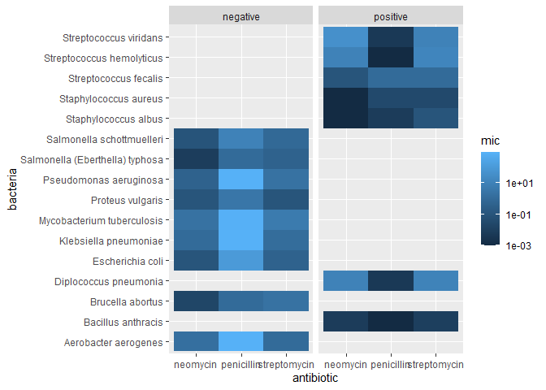
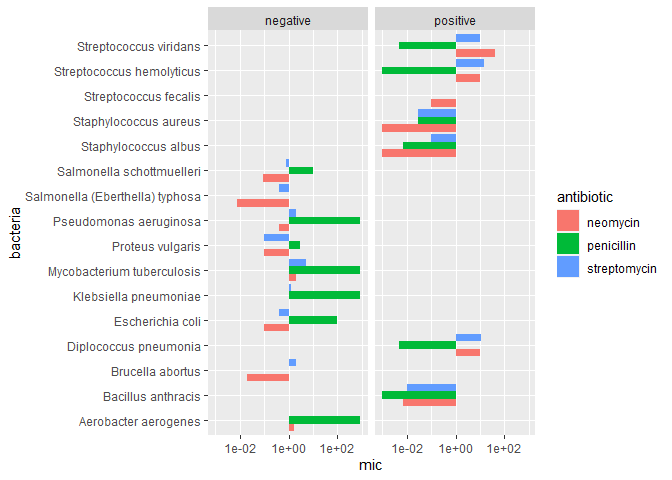
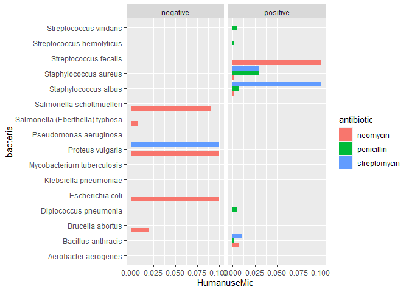
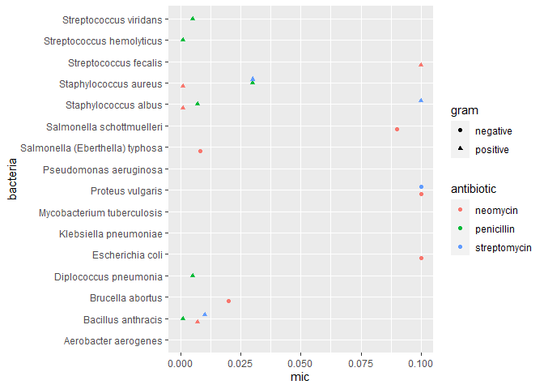

Antibiotics
================
Anna Letcher Hartman
2023

*Purpose*: Creating effective data visualizations is an *iterative*
process; very rarely will the first graph you make be the most
effective. The most effective thing you can do to be successful in this
iterative process is to *try multiple graphs* of the same data.

Furthermore, judging the effectiveness of a visual is completely
dependent on *the question you are trying to answer*. A visual that is
totally ineffective for one question may be perfect for answering a
different question.

In this challenge, you will practice *iterating* on data visualization,
and will anchor the *assessment* of your visuals using two different
questions.

*Note*: Please complete your initial visual design **alone**. Work on
both of your graphs alone, and save a version to your repo *before*
coming together with your team. This way you can all bring a diversity
of ideas to the table!

<!-- include-rubric -->

# Grading Rubric

<!-- -------------------------------------------------- -->

Unlike exercises, **challenges will be graded**. The following rubrics
define how you will be graded, both on an individual and team basis.

## Individual

<!-- ------------------------- -->

| Category    | Needs Improvement                                                                                                | Satisfactory                                                                                                               |
|-------------|------------------------------------------------------------------------------------------------------------------|----------------------------------------------------------------------------------------------------------------------------|
| Effort      | Some task **q**’s left unattempted                                                                               | All task **q**’s attempted                                                                                                 |
| Observed    | Did not document observations, or observations incorrect                                                         | Documented correct observations based on analysis                                                                          |
| Supported   | Some observations not clearly supported by analysis                                                              | All observations clearly supported by analysis (table, graph, etc.)                                                        |
| Assessed    | Observations include claims not supported by the data, or reflect a level of certainty not warranted by the data | Observations are appropriately qualified by the quality & relevance of the data and (in)conclusiveness of the support      |
| Specified   | Uses the phrase “more data are necessary” without clarification                                                  | Any statement that “more data are necessary” specifies which *specific* data are needed to answer what *specific* question |
| Code Styled | Violations of the [style guide](https://style.tidyverse.org/) hinder readability                                 | Code sufficiently close to the [style guide](https://style.tidyverse.org/)                                                 |

## Due Date

<!-- ------------------------- -->

All the deliverables stated in the rubrics above are due **at midnight**
before the day of the class discussion of the challenge. See the
[Syllabus](https://docs.google.com/document/d/1qeP6DUS8Djq_A0HMllMqsSqX3a9dbcx1/edit?usp=sharing&ouid=110386251748498665069&rtpof=true&sd=true)
for more information.

``` r
library(tidyverse)
```

    ## ── Attaching packages ─────────────────────────────────────── tidyverse 1.3.2 ──
    ## ✔ ggplot2 3.4.0      ✔ purrr   1.0.1 
    ## ✔ tibble  3.1.8      ✔ dplyr   1.0.10
    ## ✔ tidyr   1.2.1      ✔ stringr 1.5.0 
    ## ✔ readr   2.1.3      ✔ forcats 0.5.2 
    ## ── Conflicts ────────────────────────────────────────── tidyverse_conflicts() ──
    ## ✖ dplyr::filter() masks stats::filter()
    ## ✖ dplyr::lag()    masks stats::lag()

``` r
library(ggrepel)
```

*Background*: The data\[1\] we study in this challenge report the
[*minimum inhibitory
concentration*](https://en.wikipedia.org/wiki/Minimum_inhibitory_concentration)
(MIC) of three drugs for different bacteria. The smaller the MIC for a
given drug and bacteria pair, the more practical the drug is for
treating that particular bacteria. An MIC value of *at most* 0.1 is
considered necessary for treating human patients.

These data report MIC values for three antibiotics—penicillin,
streptomycin, and neomycin—on 16 bacteria. Bacteria are categorized into
a genus based on a number of features, including their resistance to
antibiotics.

``` r
## NOTE: If you extracted all challenges to the same location,
## you shouldn't have to change this filename
filename <- "./data/antibiotics.csv"

## Load the data
df_antibiotics <- read_csv(filename)
```

    ## Rows: 16 Columns: 5
    ## ── Column specification ────────────────────────────────────────────────────────
    ## Delimiter: ","
    ## chr (2): bacteria, gram
    ## dbl (3): penicillin, streptomycin, neomycin
    ## 
    ## ℹ Use `spec()` to retrieve the full column specification for this data.
    ## ℹ Specify the column types or set `show_col_types = FALSE` to quiet this message.

``` r
df_antibiotics %>% knitr::kable()
```

| bacteria                        | penicillin | streptomycin | neomycin | gram     |
|:--------------------------------|-----------:|-------------:|---------:|:---------|
| Aerobacter aerogenes            |    870.000 |         1.00 |    1.600 | negative |
| Brucella abortus                |      1.000 |         2.00 |    0.020 | negative |
| Bacillus anthracis              |      0.001 |         0.01 |    0.007 | positive |
| Diplococcus pneumonia           |      0.005 |        11.00 |   10.000 | positive |
| Escherichia coli                |    100.000 |         0.40 |    0.100 | negative |
| Klebsiella pneumoniae           |    850.000 |         1.20 |    1.000 | negative |
| Mycobacterium tuberculosis      |    800.000 |         5.00 |    2.000 | negative |
| Proteus vulgaris                |      3.000 |         0.10 |    0.100 | negative |
| Pseudomonas aeruginosa          |    850.000 |         2.00 |    0.400 | negative |
| Salmonella (Eberthella) typhosa |      1.000 |         0.40 |    0.008 | negative |
| Salmonella schottmuelleri       |     10.000 |         0.80 |    0.090 | negative |
| Staphylococcus albus            |      0.007 |         0.10 |    0.001 | positive |
| Staphylococcus aureus           |      0.030 |         0.03 |    0.001 | positive |
| Streptococcus fecalis           |      1.000 |         1.00 |    0.100 | positive |
| Streptococcus hemolyticus       |      0.001 |        14.00 |   10.000 | positive |
| Streptococcus viridans          |      0.005 |        10.00 |   40.000 | positive |

# Visualization

<!-- -------------------------------------------------- -->

### **q1** Prototype 5 visuals

To start, construct **5 qualitatively different visualizations of the
data** `df_antibiotics`. These **cannot** be simple variations on the
same graph; for instance, if two of your visuals could be made identical
by calling `coord_flip()`, then these are *not* qualitatively different.

For all five of the visuals, you must show information on *all 16
bacteria*. For the first two visuals, you must *show all variables*.

*Hint 1*: Try working quickly on this part; come up with a bunch of
ideas, and don’t fixate on any one idea for too long. You will have a
chance to refine later in this challenge.

*Hint 2*: The data `df_antibiotics` are in a *wide* format; it may be
helpful to `pivot_longer()` the data to make certain visuals easier to
construct.

``` r
theme_common <- function() {
  theme_minimal() %+replace%
  theme(
    axis.text.x = element_text(size = 12),
    axis.text.y = element_text(size = 12),
    axis.title.x = element_text(margin = margin(4, 4, 4, 4), size = 16),
    axis.title.y = element_text(margin = margin(4, 4, 4, 4), size = 16, angle = 90),

    legend.title = element_text(size = 16),
    legend.text = element_text(size = 12),

    strip.text.x = element_text(size = 12),
    strip.text.y = element_text(size = 12),

    panel.grid.major = element_line(color = "grey90"),
    panel.grid.minor = element_line(color = "grey90"),

    aspect.ratio = 4 / 4,

    plot.margin = unit(c(t = +0, b = +0, r = +0, l = +0), "cm"),
    plot.title = element_text(size = 18),
    plot.title.position = "plot",
    plot.subtitle = element_text(size = 16),
    plot.caption = element_text(size = 12)
  )
}

df_antibiotic_long <- 
  df_antibiotics %>%
  pivot_longer(
    names_to = "antibiotic",
    values_to = "mic",
    cols = - c(bacteria, gram)
  )

df_antibiotic_long
```

    ## # A tibble: 48 × 4
    ##    bacteria              gram     antibiotic       mic
    ##    <chr>                 <chr>    <chr>          <dbl>
    ##  1 Aerobacter aerogenes  negative penicillin   870    
    ##  2 Aerobacter aerogenes  negative streptomycin   1    
    ##  3 Aerobacter aerogenes  negative neomycin       1.6  
    ##  4 Brucella abortus      negative penicillin     1    
    ##  5 Brucella abortus      negative streptomycin   2    
    ##  6 Brucella abortus      negative neomycin       0.02 
    ##  7 Bacillus anthracis    positive penicillin     0.001
    ##  8 Bacillus anthracis    positive streptomycin   0.01 
    ##  9 Bacillus anthracis    positive neomycin       0.007
    ## 10 Diplococcus pneumonia positive penicillin     0.005
    ## # … with 38 more rows

#### Visual 1 (All variables)

In this visual you must show *all three* effectiveness values for *all
16 bacteria*. You must also show whether or not each bacterium is Gram
positive or negative.

``` r
# WRITE YOUR CODE HERE

df_antibiotic_long %>%
  mutate(logMic = log(mic)) %>% 
  arrange(gram) %>% 
  ggplot(aes(antibiotic, bacteria, fill = logMic, color = gram)) +
  geom_tile() +
  theme_common()
```

<!-- -->

#### Visual 2 (All variables)

In this visual you must show *all three* effectiveness values for *all
16 bacteria*. You must also show whether or not each bacterium is Gram
positive or negative.

Note that your visual must be *qualitatively different* from *all* of
your other visuals.

``` r
df_antibiotic_long %>%
  mutate(logMic = log(mic)) %>% 
  ggplot(aes(logMic, bacteria, color = antibiotic, shape = gram)) +
  geom_point() +
  theme_common()
```

<!-- -->

#### Visual 3 (Some variables)

In this visual you may show a *subset* of the variables (`penicillin`,
`streptomycin`, `neomycin`, `gram`), but you must still show *all 16
bacteria*.

Note that your visual must be *qualitatively different* from *all* of
your other visuals.

``` r
# WRITE YOUR CODE HERE
df_antibiotic_long %>%
  mutate(HumanuseMic = na_if(mic, mic <= 0.1)) %>% 
  #filter(mic <= 0.1) %>% 
  ggplot(aes(bacteria, HumanuseMic, fill = antibiotic, alpha = gram)) +
  geom_col(position = "dodge") +
  coord_flip()+
  theme_common()+
  ylim(0, 0.1)
```

    ## Warning: Using alpha for a discrete variable is not advised.

    ## Warning: Removed 29 rows containing missing values (`geom_col()`).

<!-- -->

#### Visual 4 (Some variables)

In this visual you may show a *subset* of the variables (`penicillin`,
`streptomycin`, `neomycin`, `gram`), but you must still show *all 16
bacteria*.

Note that your visual must be *qualitatively different* from *all* of
your other visuals.

``` r
# WRITE YOUR CODE HERE
df_antibiotic_long %>%
  #arrange(desc(mic)) %>% 
  ggplot(aes(mic, bacteria, color = antibiotic, shape = gram)) +
  geom_point() +
  theme_common()+
  xlim(0, 0.1)
```

    ## Warning: Removed 29 rows containing missing values (`geom_point()`).

<!-- -->

#### Visual 5 (Some variables)

In this visual you may show a *subset* of the variables (`penicillin`,
`streptomycin`, `neomycin`, `gram`), but you must still show *all 16
bacteria*.

Note that your visual must be *qualitatively different* from *all* of
your other visuals.

``` r
# WRITE YOUR CODE HERE
df_antibiotic_long %>%
  mutate(logMic = log(mic)) %>% 
  arrange(desc(gram)) %>% 
  ggplot(aes(gram, bacteria, fill = logMic)) +
  geom_tile() +
  theme_common()
```

<!-- -->

### **q2** Assess your visuals

There are **two questions** below; use your five visuals to help answer
both Guiding Questions. Note that you must also identify which of your
five visuals were most helpful in answering the questions.

*Hint 1*: It’s possible that *none* of your visuals is effective in
answering the questions below. You may need to revise one or more of
your visuals to answer the questions below!

*Hint 2*: It’s **highly unlikely** that the same visual is the most
effective at helping answer both guiding questions. **Use this as an
opportunity to think about why this is.**

#### Guiding Question 1

> How do the three antibiotics vary in their effectiveness against
> bacteria of different genera and Gram stain? penicillin, streptomycin,
> and neomycin

*Observations* - What is your response to the question above? -
streptomycin is effective in treating humans against only 3 bacteria in
this data set all of witch are gram positive. Outside of treating humans
has a mid range effectiveness. Neomycin is effective in treating humans
against 9 bacteria in this data set, 5 gram negative and 4 gram
positive, the largest number of any antibiotic. Penicillin had the
widest spread of effectiveness with the highest and lowest mic. It is
effective in treating humans against 5 gram positive bacteria in this
data set.

\- Which of your visuals above (1 through 5) is **most effective** at
helping to answer this question? - 2 and 4

- Why? - two helped me see the bigger picture and four made it easy to
  see how effective they actually were in humans

#### Guiding Question 2

In 1974 *Diplococcus pneumoniae* was renamed *Streptococcus pneumoniae*,
and in 1984 *Streptococcus fecalis* was renamed *Enterococcus fecalis*
\[2\].

> Why was *Diplococcus pneumoniae* was renamed *Streptococcus
> pneumoniae*?

*Observations* - What is your response to the question above? - I am not
sure that we have enough information to anser this question, I don’t
totally understand what the change means even after googling, but from
looking at my graphs it seems like it might have been renamed because it
is gram negative? or because panicillin has a similar amount of
effectiveness on it compare to other strepto caucouse?

\- Which of your visuals above (1 through 5) is **most effective** at
helping to answer this question? - (Write your response here) 5 and 4

\- Why? - five very clearly shows gram positive vs gram negative

References

<!-- -------------------------------------------------- -->

\[1\] Neomycin in skin infections: A new topical antibiotic with wide
antibacterial range and rarely sensitizing. Scope. 1951;3(5):4-7.

\[2\] Wainer and Lysen, “That’s Funny…” *American Scientist* (2009)
[link](https://www.americanscientist.org/article/thats-funny)
