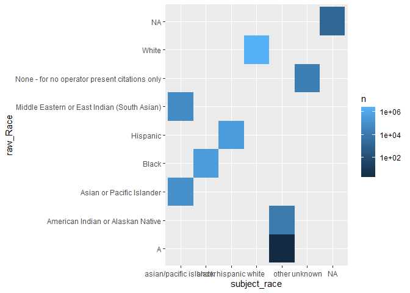
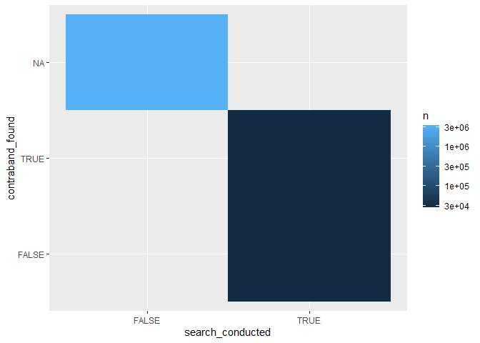
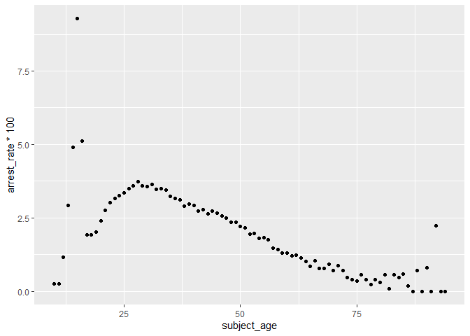
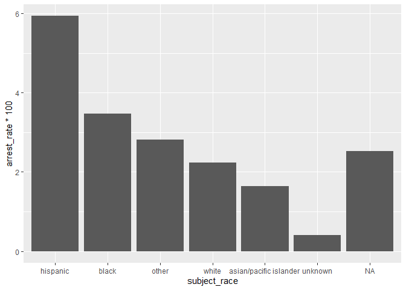

Massachusetts Highway Stops
================
(Your name here)
2020-

- <a href="#grading-rubric" id="toc-grading-rubric">Grading Rubric</a>
  - <a href="#individual" id="toc-individual">Individual</a>
  - <a href="#due-date" id="toc-due-date">Due Date</a>
- <a href="#setup" id="toc-setup">Setup</a>
  - <a
    href="#q1-go-to-the-stanford-open-policing-project-page-and-download-the-massachusetts-state-police-records-in-rds-format-move-the-data-to-your-data-folder-and-match-the-filename-to-load-the-data"
    id="toc-q1-go-to-the-stanford-open-policing-project-page-and-download-the-massachusetts-state-police-records-in-rds-format-move-the-data-to-your-data-folder-and-match-the-filename-to-load-the-data"><strong>q1</strong>
    Go to the Stanford Open Policing Project page and download the
    Massachusetts State Police records in <code>Rds</code> format. Move the
    data to your <code>data</code> folder and match the
    <code>filename</code> to load the data.</a>
- <a href="#eda" id="toc-eda">EDA</a>
  - <a
    href="#q2-do-your-first-checks-on-the-dataset-what-are-the-basic-facts-about-this-dataset"
    id="toc-q2-do-your-first-checks-on-the-dataset-what-are-the-basic-facts-about-this-dataset"><strong>q2</strong>
    Do your “first checks” on the dataset. What are the basic facts about
    this dataset?</a>
  - <a
    href="#q3-check-the-set-of-factor-levels-for-subject_race-and-raw_race-what-do-you-note-about-overlap--difference-between-the-two-sets"
    id="toc-q3-check-the-set-of-factor-levels-for-subject_race-and-raw_race-what-do-you-note-about-overlap--difference-between-the-two-sets"><strong>q3</strong>
    Check the set of factor levels for <code>subject_race</code> and
    <code>raw_Race</code>. What do you note about overlap / difference
    between the two sets?</a>
  - <a
    href="#q4-check-whether-subject_race-and-raw_race-match-for-a-large-fraction-of-cases-which-of-the-two-hypotheses-above-is-most-likely-based-on-your-results"
    id="toc-q4-check-whether-subject_race-and-raw_race-match-for-a-large-fraction-of-cases-which-of-the-two-hypotheses-above-is-most-likely-based-on-your-results"><strong>q4</strong>
    Check whether <code>subject_race</code> and <code>raw_Race</code> match
    for a large fraction of cases. Which of the two hypotheses above is most
    likely, based on your results?</a>
  - <a href="#vis" id="toc-vis">Vis</a>
    - <a
      href="#q5-compare-the-arrest-ratethe-fraction-of-total-cases-in-which-the-subject-was-arrestedacross-different-factors-create-as-many-visuals-or-tables-as-you-need-but-make-sure-to-check-the-trends-across-all-of-the-subject-variables-answer-the-questions-under-observations-below"
      id="toc-q5-compare-the-arrest-ratethe-fraction-of-total-cases-in-which-the-subject-was-arrestedacross-different-factors-create-as-many-visuals-or-tables-as-you-need-but-make-sure-to-check-the-trends-across-all-of-the-subject-variables-answer-the-questions-under-observations-below"><strong>q5</strong>
      Compare the <em>arrest rate</em>—the fraction of total cases in which
      the subject was arrested—across different factors. Create as many
      visuals (or tables) as you need, but make sure to check the trends
      across all of the <code>subject</code> variables. Answer the questions
      under <em>observations</em> below.</a>
- <a href="#modeling" id="toc-modeling">Modeling</a>
  - <a
    href="#q6-run-the-following-code-and-interpret-the-regression-coefficients-answer-the-the-questions-under-observations-below"
    id="toc-q6-run-the-following-code-and-interpret-the-regression-coefficients-answer-the-the-questions-under-observations-below"><strong>q6</strong>
    Run the following code and interpret the regression coefficients. Answer
    the the questions under <em>observations</em> below.</a>
  - <a
    href="#q7-re-fit-the-logistic-regression-from-q6-setting-white-as-the-reference-level-for-subject_race-interpret-the-the-model-terms-and-answer-the-questions-below"
    id="toc-q7-re-fit-the-logistic-regression-from-q6-setting-white-as-the-reference-level-for-subject_race-interpret-the-the-model-terms-and-answer-the-questions-below"><strong>q7</strong>
    Re-fit the logistic regression from q6 setting <code>"white"</code> as
    the reference level for <code>subject_race</code>. Interpret the the
    model terms and answer the questions below.</a>
  - <a
    href="#q8-re-fit-the-model-using-a-factor-indicating-the-presence-of-contraband-in-the-subjects-vehicle-answer-the-questions-under-observations-below"
    id="toc-q8-re-fit-the-model-using-a-factor-indicating-the-presence-of-contraband-in-the-subjects-vehicle-answer-the-questions-under-observations-below"><strong>q8</strong>
    Re-fit the model using a factor indicating the presence of contraband in
    the subject’s vehicle. Answer the questions under <em>observations</em>
    below.</a>
  - <a
    href="#q9-go-deeper-pose-at-least-one-more-question-about-the-data-and-fit-at-least-one-more-model-in-support-of-answering-that-question"
    id="toc-q9-go-deeper-pose-at-least-one-more-question-about-the-data-and-fit-at-least-one-more-model-in-support-of-answering-that-question"><strong>q9</strong>
    Go deeper: Pose at least one more question about the data and fit at
    least one more model in support of answering that question.</a>
  - <a href="#further-reading" id="toc-further-reading">Further Reading</a>

*Purpose*: In this last challenge we’ll focus on using logistic
regression to study a large, complicated dataset. Interpreting the
results of a model can be challenging—both in terms of the statistics
and the real-world reasoning—so we’ll get some practice in this
challenge.

<!-- include-rubric -->

# Grading Rubric

<!-- -------------------------------------------------- -->

Unlike exercises, **challenges will be graded**. The following rubrics
define how you will be graded, both on an individual and team basis.

## Individual

<!-- ------------------------- -->

| Category    | Needs Improvement                                                                                                | Satisfactory                                                                                                               |
|-------------|------------------------------------------------------------------------------------------------------------------|----------------------------------------------------------------------------------------------------------------------------|
| Effort      | Some task **q**’s left unattempted                                                                               | All task **q**’s attempted                                                                                                 |
| Observed    | Did not document observations, or observations incorrect                                                         | Documented correct observations based on analysis                                                                          |
| Supported   | Some observations not clearly supported by analysis                                                              | All observations clearly supported by analysis (table, graph, etc.)                                                        |
| Assessed    | Observations include claims not supported by the data, or reflect a level of certainty not warranted by the data | Observations are appropriately qualified by the quality & relevance of the data and (in)conclusiveness of the support      |
| Specified   | Uses the phrase “more data are necessary” without clarification                                                  | Any statement that “more data are necessary” specifies which *specific* data are needed to answer what *specific* question |
| Code Styled | Violations of the [style guide](https://style.tidyverse.org/) hinder readability                                 | Code sufficiently close to the [style guide](https://style.tidyverse.org/)                                                 |

## Due Date

<!-- ------------------------- -->

All the deliverables stated in the rubrics above are due **at midnight**
before the day of the class discussion of the challenge. See the
[Syllabus](https://docs.google.com/document/d/1qeP6DUS8Djq_A0HMllMqsSqX3a9dbcx1/edit?usp=sharing&ouid=110386251748498665069&rtpof=true&sd=true)
for more information.

*Background*: We’ll study data from the [Stanford Open Policing
Project](https://openpolicing.stanford.edu/data/), specifically their
dataset on Massachusetts State Patrol police stops.

``` r
library(tidyverse)
```

    ## ── Attaching packages ─────────────────────────────────────── tidyverse 1.3.2 ──
    ## ✔ ggplot2 3.4.0      ✔ purrr   1.0.1 
    ## ✔ tibble  3.1.8      ✔ dplyr   1.0.10
    ## ✔ tidyr   1.2.1      ✔ stringr 1.5.0 
    ## ✔ readr   2.1.3      ✔ forcats 0.5.2 
    ## ── Conflicts ────────────────────────────────────────── tidyverse_conflicts() ──
    ## ✖ dplyr::filter() masks stats::filter()
    ## ✖ dplyr::lag()    masks stats::lag()

``` r
library(broom)
```

# Setup

<!-- -------------------------------------------------- -->

### **q1** Go to the [Stanford Open Policing Project](https://openpolicing.stanford.edu/data/) page and download the Massachusetts State Police records in `Rds` format. Move the data to your `data` folder and match the `filename` to load the data.

*Note*: An `Rds` file is an R-specific file format. The function
`readRDS` will read these files.

``` r
## TODO: Download the data, move to your data folder, and load it
filename <- "data/ma_statewide_2020_04_01.rds"
df_data <- readRDS(filename)
```

# EDA

<!-- -------------------------------------------------- -->

### **q2** Do your “first checks” on the dataset. What are the basic facts about this dataset?

``` r
glimpse(df_data)
```

    ## Rows: 3,416,238
    ## Columns: 24
    ## $ raw_row_number             <chr> "1", "2", "3", "4", "5", "6", "7", "8", "9"…
    ## $ date                       <date> 2007-06-06, 2007-06-07, 2007-06-07, 2007-0…
    ## $ location                   <chr> "MIDDLEBOROUGH", "SEEKONK", "MEDFORD", "MED…
    ## $ county_name                <chr> "Plymouth County", "Bristol County", "Middl…
    ## $ subject_age                <int> 33, 36, 56, 37, 22, 34, 54, 31, 21, 56, 56,…
    ## $ subject_race               <fct> white, white, white, white, hispanic, white…
    ## $ subject_sex                <fct> male, male, female, male, female, male, mal…
    ## $ type                       <fct> vehicular, vehicular, vehicular, vehicular,…
    ## $ arrest_made                <lgl> FALSE, FALSE, FALSE, FALSE, FALSE, FALSE, F…
    ## $ citation_issued            <lgl> TRUE, FALSE, FALSE, FALSE, TRUE, TRUE, TRUE…
    ## $ warning_issued             <lgl> FALSE, TRUE, TRUE, TRUE, FALSE, FALSE, FALS…
    ## $ outcome                    <fct> citation, warning, warning, warning, citati…
    ## $ contraband_found           <lgl> NA, FALSE, NA, NA, NA, NA, NA, NA, NA, NA, …
    ## $ contraband_drugs           <lgl> NA, FALSE, NA, NA, NA, NA, NA, NA, NA, NA, …
    ## $ contraband_weapons         <lgl> NA, FALSE, NA, NA, NA, NA, NA, NA, NA, NA, …
    ## $ contraband_alcohol         <lgl> FALSE, FALSE, FALSE, FALSE, FALSE, FALSE, F…
    ## $ contraband_other           <lgl> NA, FALSE, NA, NA, NA, NA, NA, NA, NA, NA, …
    ## $ frisk_performed            <lgl> NA, FALSE, NA, NA, NA, NA, NA, NA, NA, NA, …
    ## $ search_conducted           <lgl> FALSE, TRUE, FALSE, FALSE, FALSE, FALSE, FA…
    ## $ search_basis               <fct> NA, other, NA, NA, NA, NA, NA, NA, NA, NA, …
    ## $ reason_for_stop            <chr> "Speed", NA, NA, NA, NA, "Speed", NA, NA, N…
    ## $ vehicle_type               <chr> "Passenger", "Commercial", "Passenger", "Co…
    ## $ vehicle_registration_state <fct> MA, MA, MA, MA, MA, MA, MA, MA, MA, MA, MA,…
    ## $ raw_Race                   <chr> "White", "White", "White", "White", "Hispan…

``` r
summary(df_data)
```

    ##  raw_row_number          date              location         county_name       
    ##  Length:3416238     Min.   :2007-01-01   Length:3416238     Length:3416238    
    ##  Class :character   1st Qu.:2009-04-22   Class :character   Class :character  
    ##  Mode  :character   Median :2011-07-08   Mode  :character   Mode  :character  
    ##                     Mean   :2011-07-16                                        
    ##                     3rd Qu.:2013-08-27                                        
    ##                     Max.   :2015-12-31                                        
    ##                                                                               
    ##   subject_age                     subject_race     subject_sex     
    ##  Min.   :10.00    asian/pacific islander: 166842   male  :2362238  
    ##  1st Qu.:25.00    black                 : 351610   female:1038377  
    ##  Median :34.00    hispanic              : 338317   NA's  :  15623  
    ##  Mean   :36.47    white                 :2529780                   
    ##  3rd Qu.:46.00    other                 :  11008                   
    ##  Max.   :94.00    unknown               :  17017                   
    ##  NA's   :158006   NA's                  :   1664                   
    ##          type         arrest_made     citation_issued warning_issued 
    ##  pedestrian:      0   Mode :logical   Mode :logical   Mode :logical  
    ##  vehicular :3416238   FALSE:3323303   FALSE:1244039   FALSE:2269244  
    ##                       TRUE :92019     TRUE :2171283   TRUE :1146078  
    ##                       NA's :916       NA's :916       NA's :916      
    ##                                                                      
    ##                                                                      
    ##                                                                      
    ##      outcome        contraband_found contraband_drugs contraband_weapons
    ##  warning :1146078   Mode :logical    Mode :logical    Mode :logical     
    ##  citation:2171283   FALSE:28256      FALSE:36296      FALSE:53237       
    ##  summons :      0   TRUE :27474      TRUE :19434      TRUE :2493        
    ##  arrest  :  92019   NA's :3360508    NA's :3360508    NA's :3360508     
    ##  NA's    :   6858                                                       
    ##                                                                         
    ##                                                                         
    ##  contraband_alcohol contraband_other frisk_performed search_conducted
    ##  Mode :logical      Mode :logical    Mode :logical   Mode :logical   
    ##  FALSE:3400070      FALSE:51708      FALSE:51029     FALSE:3360508   
    ##  TRUE :16168        TRUE :4022       TRUE :3602      TRUE :55730     
    ##                     NA's :3360508    NA's :3361607                   
    ##                                                                      
    ##                                                                      
    ##                                                                      
    ##          search_basis     reason_for_stop    vehicle_type      
    ##  k9            :      0   Length:3416238     Length:3416238    
    ##  plain view    :      0   Class :character   Class :character  
    ##  consent       :   6903   Mode  :character   Mode  :character  
    ##  probable cause:  25898                                        
    ##  other         :  18228                                        
    ##  NA's          :3365209                                        
    ##                                                                
    ##  vehicle_registration_state   raw_Race        
    ##  MA     :3053713            Length:3416238    
    ##  CT     :  82906            Class :character  
    ##  NY     :  69059            Mode  :character  
    ##  NH     :  51514                              
    ##  RI     :  39375                              
    ##  (Other): 109857                              
    ##  NA's   :   9814

Note that we have both a `subject_race` and `race_Raw` column. There are
a few possibilities as to what `race_Raw` represents:

- `race_Raw` could be the race of the police officer in the stop
- `race_Raw` could be an unprocessed version of `subject_race`

Let’s try to distinguish between these two possibilities.

### **q3** Check the set of factor levels for `subject_race` and `raw_Race`. What do you note about overlap / difference between the two sets?

``` r
## TODO: Determine the factor levels for subject_race and raw_Race

unique(df_data$subject_race)
```

    ## [1] white                  hispanic               black                 
    ## [4] asian/pacific islander other                  <NA>                  
    ## [7] unknown               
    ## Levels: asian/pacific islander black hispanic white other unknown

``` r
unique(df_data$raw_Race)
```

    ## [1] "White"                                        
    ## [2] "Hispanic"                                     
    ## [3] "Black"                                        
    ## [4] "Asian or Pacific Islander"                    
    ## [5] "Middle Eastern or East Indian (South Asian)"  
    ## [6] "American Indian or Alaskan Native"            
    ## [7] NA                                             
    ## [8] "None - for no operator present citations only"
    ## [9] "A"

``` r
# #df_data %>% 
# semi_join(df_data$subject_race,df_data$raw_Race)
# 
# df_data %>% 
# anti_join(subject_race,raw_Race)
df_data %>% 
  filter(raw_Race == "None - for no operator present citations only")
```

    ## # A tibble: 17,017 × 24
    ##    raw_row_nu…¹ date       locat…² count…³ subje…⁴ subje…⁵ subje…⁶ type  arres…⁷
    ##    <chr>        <date>     <chr>   <chr>     <int> <fct>   <fct>   <fct> <lgl>  
    ##  1 2406         2007-06-12 MILLBU… Worces…      NA unknown <NA>    vehi… FALSE  
    ##  2 2407         2007-06-12 MILLBU… Worces…      NA unknown <NA>    vehi… FALSE  
    ##  3 2408         2007-06-12 MILLBU… Worces…      NA unknown <NA>    vehi… FALSE  
    ##  4 2409         2007-06-12 MILLBU… Worces…      NA unknown <NA>    vehi… FALSE  
    ##  5 2416         2007-06-12 MILLBU… Worces…      NA unknown <NA>    vehi… FALSE  
    ##  6 2417         2007-06-12 MILLBU… Worces…      NA unknown <NA>    vehi… FALSE  
    ##  7 2418         2007-06-13 MILLBU… Worces…      NA unknown <NA>    vehi… FALSE  
    ##  8 4062         2007-05-30 WESTBO… Worces…      NA unknown <NA>    vehi… FALSE  
    ##  9 4065         2007-05-30 WESTBO… Worces…      NA unknown <NA>    vehi… FALSE  
    ## 10 4067         2007-05-30 WESTBO… Worces…      NA unknown <NA>    vehi… FALSE  
    ## # … with 17,007 more rows, 15 more variables: citation_issued <lgl>,
    ## #   warning_issued <lgl>, outcome <fct>, contraband_found <lgl>,
    ## #   contraband_drugs <lgl>, contraband_weapons <lgl>, contraband_alcohol <lgl>,
    ## #   contraband_other <lgl>, frisk_performed <lgl>, search_conducted <lgl>,
    ## #   search_basis <fct>, reason_for_stop <chr>, vehicle_type <chr>,
    ## #   vehicle_registration_state <fct>, raw_Race <chr>, and abbreviated variable
    ## #   names ¹​raw_row_number, ²​location, ³​county_name, ⁴​subject_age, …

**Observations**:

- What are the unique values for `subject_race`?
  - white, hispanic, black, asian/pacific islander, other, \<NA\>,
    unknown
- What are the unique values for `raw_Race`?
  - “White”, “Hispanic”, “Black”, “Asian or Pacific Islander”, “Middle
    Eastern or East Indian (South Asian)”, “American Indian or Alaskan
    Native”, NA, “None - for no operator present citations only”, “A”
- What is the overlap between the two sets?
  - white, hispanic, black, asian/pacific islander, and NA
- What is the difference between the two sets?
  - subject_race is a factor column and contains the factors other and
    unknown

  - subject_race also contains no capital letters and uses a / instead
    of or when describing the factor Asian or Pacific Islander

  - raw_Race is a character column and contains the descriptors “Middle
    Eastern or East Indian (South Asian)”, “American Indian or Alaskan
    Native”, “None - for no operator present citations only”, and “A”

### **q4** Check whether `subject_race` and `raw_Race` match for a large fraction of cases. Which of the two hypotheses above is most likely, based on your results?

*Note*: Just to be clear, I’m *not* asking you to do a *statistical*
hypothesis test.

``` r
## TODO: Devise your own way to test the hypothesis posed above.
# df_data %>%
#   # group_by(raw_Race) %>% 
#   ggplot() +
#   geom_bar(aes(raw_Race, fill = raw_Race)) +
#   facet_wrap(~subject_race)

df_data %>%
  # group_by(raw_Race) %>% 
  count(subject_race, raw_Race) %>%
  ggplot(aes(subject_race, raw_Race, fill = n)) +
  geom_tile() +
  scale_fill_continuous(trans = "log10") 
```

<!-- -->

``` r
df_data %>%
  # group_by(raw_Race) %>% 
  count(search_conducted, contraband_found) %>%
  ggplot(aes(search_conducted, contraband_found, fill = n)) +
  geom_tile() +
  scale_fill_continuous(trans = "log10") 
```

<!-- -->

``` r
# 
#   ggplot() +
#   geom_bar(aes(subject_race, fill = subject_race)) +
#   facet_wrap(~raw_Race) +
#   scale_fill_log10() +
#   coord_flip()
```

**Observations**

Between the two hypotheses:

- `race_Raw` could be the race of the police officer in the stop
- `race_Raw` could be an unprocessed version of `subject_race`

which is most plausible, based on your results?

- based on my results, `race_Raw` being an unprocessed version of
  `subject_race` is most plausible.

## Vis

<!-- ------------------------- -->

### **q5** Compare the *arrest rate*—the fraction of total cases in which the subject was arrested—across different factors. Create as many visuals (or tables) as you need, but make sure to check the trends across all of the `subject` variables. Answer the questions under *observations* below.

``` r
# subject_age subject_race subject_sex arrest_made
df_age_arrest_rate <-
  df_data %>%
    group_by(subject_age) %>% 
    summarise(
      n = n(),
      n_arrest_made = sum(arrest_made, na.rm = TRUE)
    ) %>% 
    mutate(arrest_rate = n_arrest_made/n)

df_sex_arrest_rate <-
  df_data %>%
    group_by(subject_sex) %>% 
    summarise(
      n = n(),
      n_arrest_made = sum(arrest_made, na.rm = TRUE)
    ) %>% 
    mutate(arrest_rate = n_arrest_made/n) 

df_race_arrest_rate <-
  df_data %>%
    group_by(subject_race) %>% 
    summarise(
      n = n(),
      n_arrest_made = sum(arrest_made, na.rm = TRUE)
    ) %>% 
  mutate(arrest_rate = n_arrest_made/n)

df_age_arrest_rate
```

    ## # A tibble: 86 × 4
    ##    subject_age     n n_arrest_made arrest_rate
    ##          <int> <int>         <int>       <dbl>
    ##  1          10   398             1     0.00251
    ##  2          11   397             1     0.00252
    ##  3          12   262             3     0.0115 
    ##  4          13   206             6     0.0291 
    ##  5          14   306            15     0.0490 
    ##  6          15   474            44     0.0928 
    ##  7          16  2049           105     0.0512 
    ##  8          17 17513           338     0.0193 
    ##  9          18 48909           940     0.0192 
    ## 10          19 83065          1667     0.0201 
    ## # … with 76 more rows

``` r
df_sex_arrest_rate
```

    ## # A tibble: 3 × 4
    ##   subject_sex       n n_arrest_made arrest_rate
    ##   <fct>         <int>         <int>       <dbl>
    ## 1 male        2362238         75920     0.0321 
    ## 2 female      1038377         16005     0.0154 
    ## 3 <NA>          15623            94     0.00602

``` r
df_race_arrest_rate
```

    ## # A tibble: 7 × 4
    ##   subject_race                 n n_arrest_made arrest_rate
    ##   <fct>                    <int>         <int>       <dbl>
    ## 1 asian/pacific islander  166842          2748     0.0165 
    ## 2 black                   351610         12225     0.0348 
    ## 3 hispanic                338317         20085     0.0594 
    ## 4 white                  2529780         56540     0.0223 
    ## 5 other                    11008           310     0.0282 
    ## 6 unknown                  17017            69     0.00405
    ## 7 <NA>                      1664            42     0.0252

``` r
df_age_arrest_rate %>% 
  ggplot(aes(subject_age, arrest_rate*100)) +
  geom_point()
```

    ## Warning: Removed 1 rows containing missing values (`geom_point()`).

<!-- -->

``` r
df_race_arrest_rate %>%
  mutate(
    subject_race = fct_reorder(subject_race, arrest_rate, .desc = TRUE)
    ) %>% 
  ggplot(aes(subject_race, arrest_rate*100)) +
  geom_col()
```

<!-- -->

**Observations**:

- How does `arrest_rate` tend to vary with `subject_age`?
  - Arrest rate is highest for 14 to 16 year olds peaking at 15 with a
    9.3% arrest rate. This could be because the drivers are
    inexperienced and or driving illegally. More outliers appear at the
    upper end of the age range. Excluding outliers subjects in their
    late twenties/early thirties have the highest arrest rate it then
    begins to decline somewhat linearly until slightly past he age of
    75.
- How does `arrest_rate` to vary with `subject_sex`?
  - males have a higher, 3.2%, arrest rate than females, 1.5%, NA has a
    .6% arrest rate
- How does `arrest_rate` tend to vary with `subject_race`?
  - arrest rate is by far the highest for hispanic people, 5.9%,
    followed by black people, 3.5%. The other (which corresponds mostly
    to the “American Indian or Alaskan Native” catagory from the raw
    race data) and NA catagories both have higher arrest rates than
    white people and Asian people or Pacific Islanders. Unknown race has
    the lowest arrest rate

# Modeling

<!-- -------------------------------------------------- -->

We’re going to use a model to study the relationship between `subject`
factors and arrest rate, but first we need to understand a bit more
about *dummy variables*

### **q6** Run the following code and interpret the regression coefficients. Answer the the questions under *observations* below.

``` r
## NOTE: No need to edit; inspect the estimated model terms.
fit_q6 <-
  glm(
    formula = arrest_made ~ subject_age + subject_race + subject_sex,
    data = df_data %>%
      filter(
        !is.na(arrest_made),
        subject_race %in% c("white", "black", "hispanic")
      ),
    family = "binomial"
  )

fit_q6 %>% 
  tidy(
    conf.int = TRUE,
    conf.level = 0.99
  ) %>% 
  select(term, conf.low, estimate, conf.high, everything())
```

    ## # A tibble: 5 × 7
    ##   term                 conf.low estimate conf.high std.error statistic   p.value
    ##   <chr>                   <dbl>    <dbl>     <dbl>     <dbl>     <dbl>     <dbl>
    ## 1 (Intercept)           -2.70    -2.67     -2.64    0.0132      -202.  0        
    ## 2 subject_age           -0.0149  -0.0142   -0.0134  0.000280     -50.5 0        
    ## 3 subject_racehispanic   0.482    0.513     0.543   0.0119        43.3 0        
    ## 4 subject_racewhite     -0.406   -0.380    -0.353   0.0103       -37.0 3.12e-299
    ## 5 subject_sexfemale     -0.778   -0.755    -0.732   0.00910      -83.0 0

**Observations**:

- Which `subject_race` levels are included in fitting the model?
  - black, hispanic, and white
- Which `subject_race` levels have terms in the model?
  - hispanic and white

You should find that each factor in the model has a level *missing* in
its set of terms. This is because R represents factors against a
*reference level*: The model treats one factor level as “default”, and
each factor model term represents a change from that “default” behavior.
For instance, the model above treats `subject_sex==male` as the
reference level, so the `subject_sexfemale` term represents the *change
in probability* of arrest due to a person being female (rather than
male).

The this reference level approach to coding factors is necessary for
[technical
reasons](https://www.andrew.cmu.edu/user/achoulde/94842/lectures/lecture10/lecture10-94842.html#why-is-one-of-the-levels-missing-in-the-regression),
but it complicates interpreting the model results. For instance; if we
want to compare two levels, neither of which are the reference level, we
have to consider the difference in their model coefficients. But if we
want to compare all levels against one “baseline” level, then we can
relevel the data to facilitate this comparison.

By default `glm` uses the first factor level present as the reference
level. Therefore we can use
`mutate(factor = fct_relevel(factor, "desired_level"))` to set our
`"desired_level"` as the reference factor.

### **q7** Re-fit the logistic regression from q6 setting `"white"` as the reference level for `subject_race`. Interpret the the model terms and answer the questions below.

``` r
## TODO: Re-fit the logistic regression, but set "white" as the reference
## level for subject_race
fit_q7 <- 
  glm(
    formula = arrest_made ~ subject_age + subject_race + subject_sex,
    data = df_data %>%
      mutate(
        subject_race = fct_relevel(subject_race, "white")
        ) %>% 
      filter(
        !is.na(arrest_made),
        subject_race %in% c("white", "black", "hispanic")
      ),
    family = "binomial"
  )

fit_q7 %>% 
  tidy(
    conf.int = TRUE,
    conf.level = 0.99
  ) %>% 
  select(term, conf.low, estimate, conf.high, everything())
```

    ## # A tibble: 5 × 7
    ##   term                 conf.low estimate conf.high std.error statistic   p.value
    ##   <chr>                   <dbl>    <dbl>     <dbl>     <dbl>     <dbl>     <dbl>
    ## 1 (Intercept)           -3.08    -3.05     -3.02    0.0109      -279.  0        
    ## 2 subject_age           -0.0149  -0.0142   -0.0134  0.000280     -50.5 0        
    ## 3 subject_raceblack      0.353    0.380     0.406   0.0103        37.0 3.12e-299
    ## 4 subject_racehispanic   0.870    0.893     0.915   0.00859      104.  0        
    ## 5 subject_sexfemale     -0.778   -0.755    -0.732   0.00910      -83.0 0

**Observations**:

- Which `subject_race` level has the highest probability of being
  arrested, according to this model? Which has the lowest probability?
  - Hispanic has the highest probability and white has the lowest
- What could explain this difference in probabilities of arrest across
  race? List **multiple** possibilities.
  - racial profiling, over policing of areas where people of color live,
- Look at the sent of variables in the dataset; do any of the columns
  relate to a potential explanation you listed?
  - Location, we could check to see if neighborhoods where more people
    of color live have higher arrest rates

One way we can explain differential arrest rates is to include some
measure indicating the presence of an arrestable offense. We’ll do this
in a particular way in the next task.

### **q8** Re-fit the model using a factor indicating the presence of contraband in the subject’s vehicle. Answer the questions under *observations* below.

``` r
## TODO: Repeat the modeling above, but control for whether contraband was found
## during the police stop
fit_q8 <-
  glm(
    formula = arrest_made ~ subject_age + subject_race + subject_sex + contraband_found,
    data = df_data %>%
      mutate(
        subject_race = fct_relevel(subject_race, "white")
        ) %>% 
      filter(
        !is.na(arrest_made),
        !is.na(contraband_found),
        subject_race %in% c("white", "black", "hispanic")
      ),
    family = "binomial"
  )

fit_q8 %>% 
  tidy(
    conf.int = TRUE,
    conf.level = 0.99
  )%>% 
  select(term, conf.low, estimate, conf.high, everything())
```

    ## # A tibble: 6 × 7
    ##   term                 conf.low estimate conf.high std.error statistic   p.value
    ##   <chr>                   <dbl>    <dbl>     <dbl>     <dbl>     <dbl>     <dbl>
    ## 1 (Intercept)           -1.81    -1.72     -1.64    0.0339      -50.8  0        
    ## 2 subject_age            0.0203   0.0225    0.0248  0.000866     26.0  2.19e-149
    ## 3 subject_raceblack     -0.121   -0.0511    0.0182  0.0270       -1.90 5.80e-  2
    ## 4 subject_racehispanic   0.159    0.221     0.281   0.0237        9.31 1.32e- 20
    ## 5 subject_sexfemale     -0.373   -0.306    -0.240   0.0257      -11.9  1.06e- 32
    ## 6 contraband_foundTRUE   0.559    0.609     0.658   0.0192       31.7  4.29e-221

**Observations**:

- How does controlling for found contraband affect the `subject_race`
  terms in the model?
  - hispanic remains the level with the highest probability of arrest,
    but the regression coefficient for black becomes negative with a
    confidence interval straddling zero. Meaning that in this model
    there is no clear correlation between being black and having a
    higher or lower arrest rate. unrelated but the coefficient on age
    also becomes positive which doesn’t make a tone of sense when we
    recall the arrest rate by age graph I made earlier.
- What does the *finding of contraband* tell us about the stop? What
  does it *not* tell us about the stop?
  - it tells you that a search was conducted and that something
    categorized as contraband was found but not what the contraband was
    or why the search was conducted

### **q9** Go deeper: Pose at least one more question about the data and fit at least one more model in support of answering that question.

``` r
fit_q9 <-
  glm(
    formula = arrest_made ~ subject_age + subject_race + subject_sex + contraband_drugs + contraband_weapons + contraband_alcohol + contraband_other,
    data = df_data %>%
      mutate(
        subject_race = fct_relevel(subject_race, "white")
        ) %>% 
      filter(
        !is.na(arrest_made),
        #!is.na(contraband_found),
        !is.na(contraband_drugs),
        !is.na(contraband_weapons),
        !is.na(contraband_alcohol),
        !is.na(contraband_other),
        #!is.na(frisk_performed),
        subject_race %in% c("white", "black", "hispanic")
      ),
    family = "binomial"
  )

fit_q9 %>% 
  tidy(
    conf.int = TRUE,
    conf.level = 0.99
  ) %>% 
  select(term, conf.low, estimate, conf.high, everything())
```

    ## # A tibble: 9 × 7
    ##   term                   conf.low estimate conf.high std.error stati…¹   p.value
    ##   <chr>                     <dbl>    <dbl>     <dbl>     <dbl>   <dbl>     <dbl>
    ## 1 (Intercept)             -1.79    -1.71     -1.62    0.0337    -50.6  0        
    ## 2 subject_age              0.0201   0.0223    0.0246  0.000873   25.6  2.68e-144
    ## 3 subject_raceblack       -0.118   -0.0478    0.0218  0.0271     -1.77 7.75e-  2
    ## 4 subject_racehispanic     0.151    0.212     0.273   0.0238      8.90 5.40e- 19
    ## 5 subject_sexfemale       -0.371   -0.304    -0.238   0.0258    -11.8  5.13e- 32
    ## 6 contraband_drugsTRUE     0.392    0.444     0.495   0.0200     22.1  1.27e-108
    ## 7 contraband_weaponsTRUE   0.118    0.232     0.345   0.0439      5.28 1.32e-  7
    ## 8 contraband_alcoholTRUE   0.564    0.633     0.703   0.0270     23.5  1.23e-121
    ## 9 contraband_otherTRUE     0.513    0.602     0.691   0.0345     17.4  4.94e- 68
    ## # … with abbreviated variable name ¹​statistic

``` r
fit_q92 <-
  glm(
    formula = arrest_made ~ subject_age + subject_race + subject_sex + contraband_drugs + contraband_weapons + contraband_alcohol + contraband_other,
    data = df_data %>%
      mutate(
        subject_race = fct_relevel(subject_race, "white"),
    contraband_drugs = if_else(is.na(contraband_drugs), FALSE, contraband_drugs),
    contraband_weapons = if_else(is.na(contraband_weapons), FALSE, contraband_weapons),
    contraband_alcohol = if_else(is.na(contraband_alcohol), FALSE, contraband_alcohol),
    contraband_other = if_else(is.na(contraband_other), FALSE, contraband_other)
  ) %>% 
      filter(
        !is.na(arrest_made),
        #!is.na(contraband_found),
        !is.na(contraband_drugs),
        !is.na(contraband_weapons),
        !is.na(contraband_alcohol),
        !is.na(contraband_other),
        #!is.na(frisk_performed),
        subject_race %in% c("white", "black", "hispanic")
      ),
    family = "binomial"
  )

fit_q92 %>% 
  tidy(
    conf.int = TRUE,
    conf.level = 0.99
  ) %>% 
  select(term, conf.low, estimate, conf.high, everything())
```

    ## # A tibble: 9 × 7
    ##   term                   conf.low estimate conf.high std.error stati…¹   p.value
    ##   <chr>                     <dbl>    <dbl>     <dbl>     <dbl>   <dbl>     <dbl>
    ## 1 (Intercept)             -3.33    -3.30    -3.27     0.0113    -292.  0        
    ## 2 subject_age             -0.0112  -0.0104  -0.00971  0.000285   -36.7 9.24e-295
    ## 3 subject_raceblack        0.330    0.357    0.384    0.0106      33.8 3.83e-251
    ## 4 subject_racehispanic     0.865    0.887    0.910    0.00884    100.  0        
    ## 5 subject_sexfemale       -0.727   -0.703   -0.679    0.00923    -76.2 0        
    ## 6 contraband_drugsTRUE     2.46     2.51     2.55     0.0180     139.  0        
    ## 7 contraband_weaponsTRUE   0.707    0.845    0.983    0.0536      15.8 3.99e- 56
    ## 8 contraband_alcoholTRUE   2.37     2.43     2.48     0.0201     121.  0        
    ## 9 contraband_otherTRUE     1.67     1.78     1.89     0.0410      43.4 0        
    ## # … with abbreviated variable name ¹​statistic

``` r
df_data %>%

  count(contraband_drugs, contraband_weapons, contraband_alcohol, contraband_other, subject_race, arrest_made,subject_sex)
```

    ## # A tibble: 355 × 8
    ##    contraband_drugs contraband_w…¹ contr…² contr…³ subje…⁴ arres…⁵ subje…⁶     n
    ##    <lgl>            <lgl>          <lgl>   <lgl>   <fct>   <lgl>   <fct>   <int>
    ##  1 FALSE            FALSE          FALSE   FALSE   asian/… FALSE   male      617
    ##  2 FALSE            FALSE          FALSE   FALSE   asian/… FALSE   female    140
    ##  3 FALSE            FALSE          FALSE   FALSE   asian/… TRUE    male      249
    ##  4 FALSE            FALSE          FALSE   FALSE   asian/… TRUE    female     27
    ##  5 FALSE            FALSE          FALSE   FALSE   black   FALSE   male     2694
    ##  6 FALSE            FALSE          FALSE   FALSE   black   FALSE   female    551
    ##  7 FALSE            FALSE          FALSE   FALSE   black   TRUE    male      985
    ##  8 FALSE            FALSE          FALSE   FALSE   black   TRUE    female    117
    ##  9 FALSE            FALSE          FALSE   FALSE   black   NA      male        1
    ## 10 FALSE            FALSE          FALSE   FALSE   hispan… FALSE   male     3712
    ## # … with 345 more rows, and abbreviated variable names ¹​contraband_weapons,
    ## #   ²​contraband_alcohol, ³​contraband_other, ⁴​subject_race, ⁵​arrest_made,
    ## #   ⁶​subject_sex

``` r
df_data %>% 
      filter(
        # !is.na(arrest_made),
        # #!is.na(contraband_found),
        # !is.na(contraband_drugs),
        # !is.na(contraband_weapons),
        # !is.na(contraband_alcohol),
        # !is.na(contraband_other),
        #!is.na(frisk_performed),
        subject_race %in% c("white", "black", "hispanic")
      ) %>%
  count(contraband_drugs, contraband_weapons, contraband_alcohol, contraband_other, subject_race, arrest_made,subject_sex)
```

    ## # A tibble: 219 × 8
    ##    contraband_drugs contraband_w…¹ contr…² contr…³ subje…⁴ arres…⁵ subje…⁶     n
    ##    <lgl>            <lgl>          <lgl>   <lgl>   <fct>   <lgl>   <fct>   <int>
    ##  1 FALSE            FALSE          FALSE   FALSE   black   FALSE   male     2694
    ##  2 FALSE            FALSE          FALSE   FALSE   black   FALSE   female    551
    ##  3 FALSE            FALSE          FALSE   FALSE   black   TRUE    male      985
    ##  4 FALSE            FALSE          FALSE   FALSE   black   TRUE    female    117
    ##  5 FALSE            FALSE          FALSE   FALSE   black   NA      male        1
    ##  6 FALSE            FALSE          FALSE   FALSE   hispan… FALSE   male     3712
    ##  7 FALSE            FALSE          FALSE   FALSE   hispan… FALSE   female    572
    ##  8 FALSE            FALSE          FALSE   FALSE   hispan… FALSE   <NA>        2
    ##  9 FALSE            FALSE          FALSE   FALSE   hispan… TRUE    male     1635
    ## 10 FALSE            FALSE          FALSE   FALSE   hispan… TRUE    female    151
    ## # … with 209 more rows, and abbreviated variable names ¹​contraband_weapons,
    ## #   ²​contraband_alcohol, ³​contraband_other, ⁴​subject_race, ⁵​arrest_made,
    ## #   ⁶​subject_sex

``` r
df_data %>%
      filter(
        !is.na(arrest_made),
        #!is.na(contraband_found),
        !is.na(contraband_drugs),
        !is.na(contraband_weapons),
        !is.na(contraband_alcohol),
        !is.na(contraband_other),
        #!is.na(frisk_performed),
        subject_race %in% c("white", "black", "hispanic")
      ) %>%
  count(contraband_drugs, contraband_weapons, contraband_alcohol, contraband_other, subject_race, arrest_made,subject_sex)
```

    ## # A tibble: 172 × 8
    ##    contraband_drugs contraband_w…¹ contr…² contr…³ subje…⁴ arres…⁵ subje…⁶     n
    ##    <lgl>            <lgl>          <lgl>   <lgl>   <fct>   <lgl>   <fct>   <int>
    ##  1 FALSE            FALSE          FALSE   FALSE   black   FALSE   male     2694
    ##  2 FALSE            FALSE          FALSE   FALSE   black   FALSE   female    551
    ##  3 FALSE            FALSE          FALSE   FALSE   black   TRUE    male      985
    ##  4 FALSE            FALSE          FALSE   FALSE   black   TRUE    female    117
    ##  5 FALSE            FALSE          FALSE   FALSE   hispan… FALSE   male     3712
    ##  6 FALSE            FALSE          FALSE   FALSE   hispan… FALSE   female    572
    ##  7 FALSE            FALSE          FALSE   FALSE   hispan… FALSE   <NA>        2
    ##  8 FALSE            FALSE          FALSE   FALSE   hispan… TRUE    male     1635
    ##  9 FALSE            FALSE          FALSE   FALSE   hispan… TRUE    female    151
    ## 10 FALSE            FALSE          FALSE   FALSE   hispan… TRUE    <NA>        2
    ## # … with 162 more rows, and abbreviated variable names ¹​contraband_weapons,
    ## #   ²​contraband_alcohol, ³​contraband_other, ⁴​subject_race, ⁵​arrest_made,
    ## #   ⁶​subject_sex

``` r
# df_data %>% 
#   mutate(
#     contraband_drugs = if_else(is.na(contraband_drugs), FALSE, contraband_drugs),
#     contraband_weapons = if_else(is.na(contraband_weapons), FALSE, contraband_weapons),
#     contraband_alcohol = if_else(is.na(contraband_alcohol), FALSE, contraband_alcohol),
#     contraband_other = if_else(is.na(contraband_other), FALSE, contraband_other)
#   ) %>%
#       filter(
#         !is.na(arrest_made),
#         #!is.na(contraband_found),
#         !is.na(contraband_drugs),
#         !is.na(contraband_weapons),
#         !is.na(contraband_alcohol),
#         !is.na(contraband_other),
#         #!is.na(frisk_performed),
#         subject_race %in% c("white", "black", "hispanic")
#       ) %>%
#   count(contraband_drugs, contraband_weapons, contraband_alcohol, contraband_other)

df_data %>% 
  mutate(
    contraband_drugs = if_else(is.na(contraband_drugs), FALSE, contraband_drugs),
    contraband_weapons = if_else(is.na(contraband_weapons), FALSE, contraband_weapons),
    contraband_alcohol = if_else(is.na(contraband_alcohol), FALSE, contraband_alcohol),
    contraband_other = if_else(is.na(contraband_other), FALSE, contraband_other)
  ) %>%
      filter(
        !is.na(arrest_made),
        #!is.na(contraband_found),
        !is.na(contraband_drugs),
        !is.na(contraband_weapons),
        !is.na(contraband_alcohol),
        !is.na(contraband_other),
        #!is.na(frisk_performed),
        subject_race %in% c("white", "black", "hispanic")
      ) %>%
  count(contraband_drugs, contraband_weapons, contraband_alcohol, contraband_other, subject_race, arrest_made,subject_sex)
```

    ## # A tibble: 175 × 8
    ##    contraband_drugs contraband_…¹ contr…² contr…³ subje…⁴ arres…⁵ subje…⁶      n
    ##    <lgl>            <lgl>         <lgl>   <lgl>   <fct>   <lgl>   <fct>    <int>
    ##  1 FALSE            FALSE         FALSE   FALSE   black   FALSE   male    241506
    ##  2 FALSE            FALSE         FALSE   FALSE   black   FALSE   female   94275
    ##  3 FALSE            FALSE         FALSE   FALSE   black   FALSE   <NA>        90
    ##  4 FALSE            FALSE         FALSE   FALSE   black   TRUE    male      9263
    ##  5 FALSE            FALSE         FALSE   FALSE   black   TRUE    female    1271
    ##  6 FALSE            FALSE         FALSE   FALSE   black   TRUE    <NA>         3
    ##  7 FALSE            FALSE         FALSE   FALSE   hispan… FALSE   male    238463
    ##  8 FALSE            FALSE         FALSE   FALSE   hispan… FALSE   female   76040
    ##  9 FALSE            FALSE         FALSE   FALSE   hispan… FALSE   <NA>       118
    ## 10 FALSE            FALSE         FALSE   FALSE   hispan… TRUE    male     15920
    ## # … with 165 more rows, and abbreviated variable names ¹​contraband_weapons,
    ## #   ²​contraband_alcohol, ³​contraband_other, ⁴​subject_race, ⁵​arrest_made,
    ## #   ⁶​subject_sex

**Observations**:

- How does the nature of the contraband found affect the probability of
  an arrest being made?
- after running my first model I noticed that there where a significant
  number of stops where alcohol was found and all other entries for
  types of contraband were NA. this pattern was not repeated for any
  other contraband type and caused me to loose data for several hundred
  thousand stops, so I updated my model to make all those NAs false
  before fitting.
- In the updated model contraband drugs and alcohol had the highest
  probability of arrest. drugs appeared slightly higher but the
  confidence intervals overlap so there is no way to say for sure.
- Weed was legalized in MA in 2016 this data sat ends in 2015. it would
  be interesting to redo the analysis with more recent data and see if
  drugs is still such a strong indicator.
- when we brake out the contraband found out by type and adjust for the
  odd missingness pattern most of the other coefficients return to
  values similar to what they were in question 7 before we added
  contraband found to the model in question 8.
- black once again becomes a meaningful indicator in arrest rate
- age is also once again negatively correlated with arrest rate
- finding weapons has a surprisingly low correlation with arrest rate
  compared to the other contraband categories. perhaps they still log
  finding a licensed weapon as contraband or having a knife in your car
  is just not actually illegal.

## Further Reading

<!-- -------------------------------------------------- -->

- Stanford Open Policing Project
  [findings](https://openpolicing.stanford.edu/findings/).
